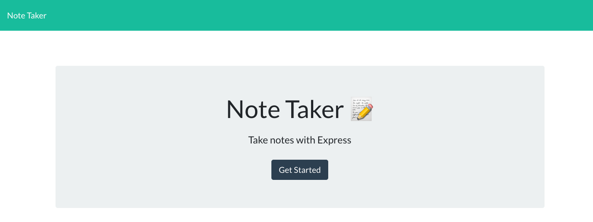
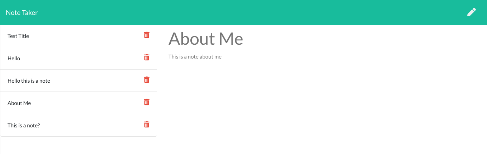

# Note Taker

## Description
Note Taker is a a dedicated Express.JS application built for the small business owner who wants to write and save notes so that they can organize their thoughts and keep track of tasks that they need to complete. In this application, a small business owner can add notes to the database using built input text area that uses API calls to the backend and adds to the database by ID.

Note Taker's backend was built using node.js on a localHost environment, and tested API get/post calls using Insomnia core. Note Taker's production enviroment was deployed on Heroku server. 

## Functionality

* Used Express.JS to create a Node.JS web server

* Setup GET routes to serve selective JSON data based on paramenters `req.param` and `req.query`

* Used Heroku to deploy a production environment server

* Created POST routes to allow server to accept incoming data and tested using Insomnia Core

* Validated data and utilized middleware in express.js 

* Updated server to serve client-side code for users to interface with

* Modularized and scaled API by using Express.js Router

* Tested application using Jest and assisted in developing a predictable application to account for scalability

## Langugages
* Node.js
* Javascript
* HTML
* CSS
* Express.js
* NPM - Jest
* CDN - Bootstrap, JQuery

## Website
https://agile-reef-72183.herokuapp.com/ 

## Reference Images

